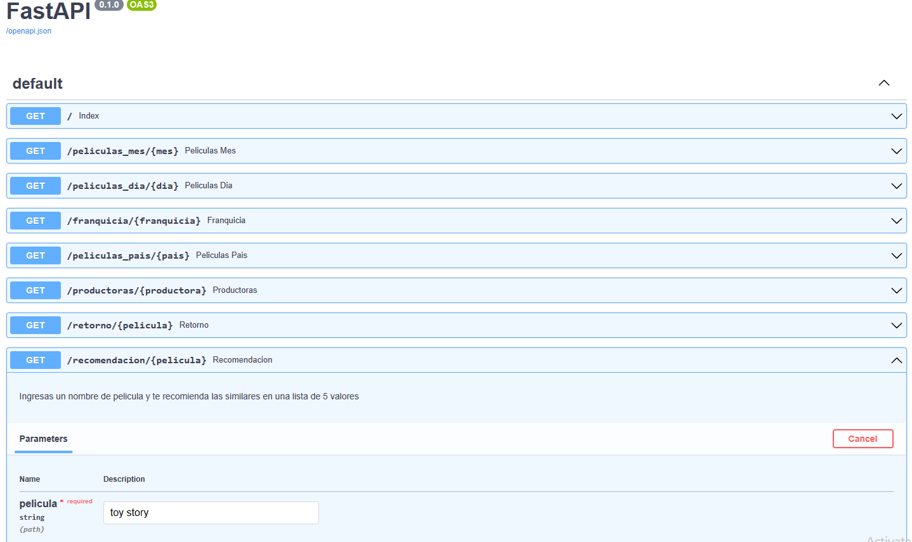
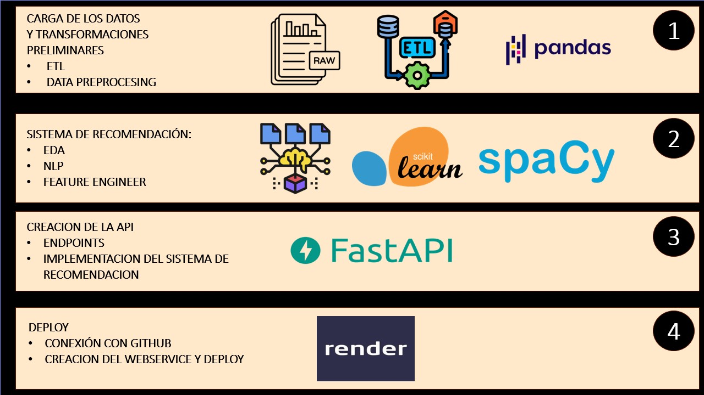
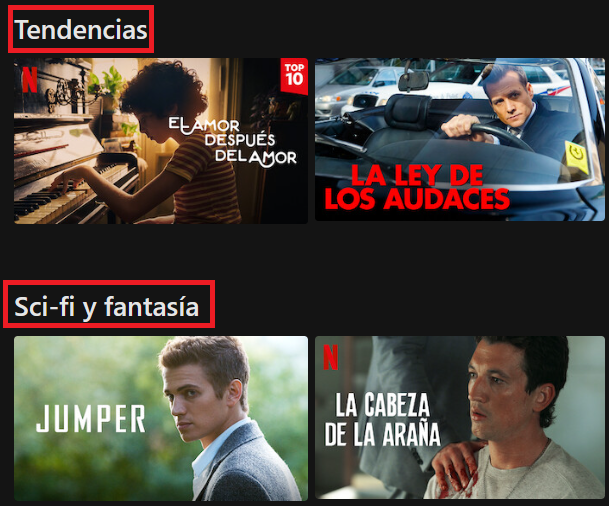
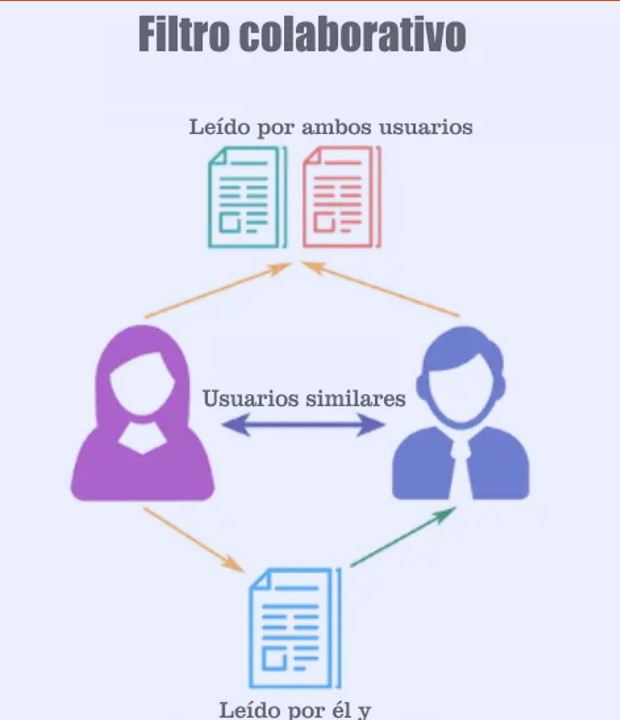
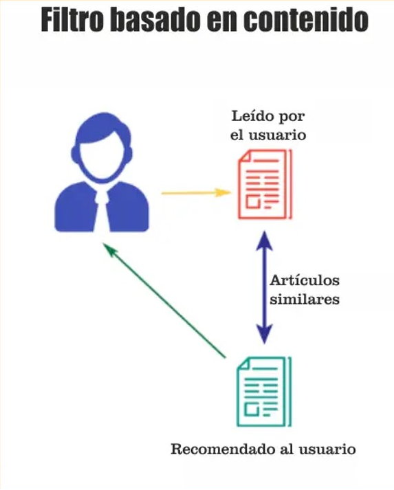
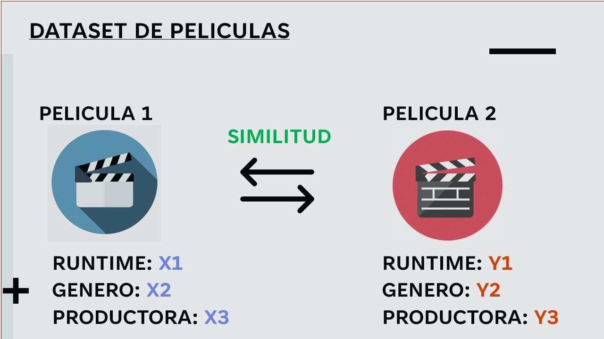
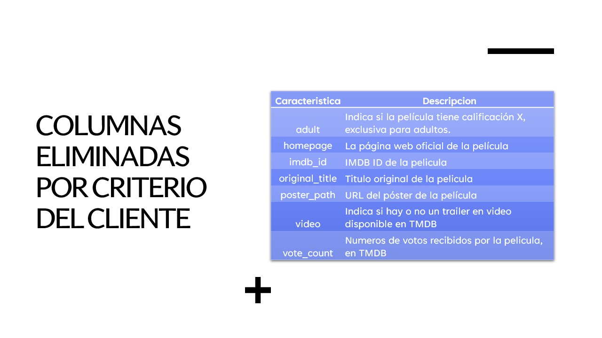
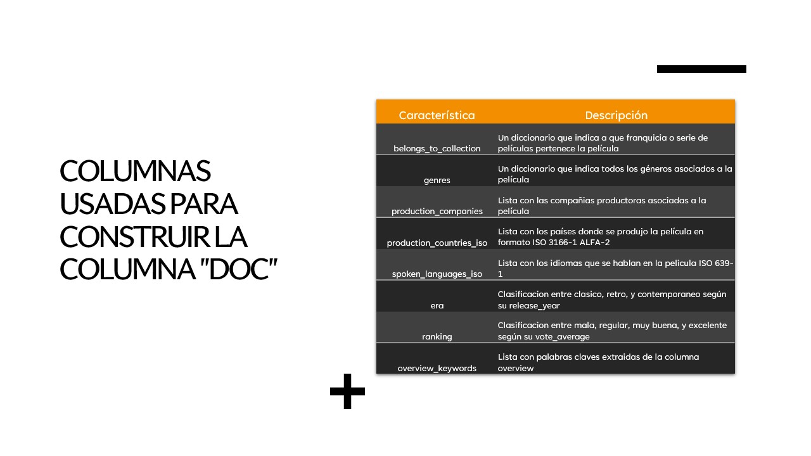
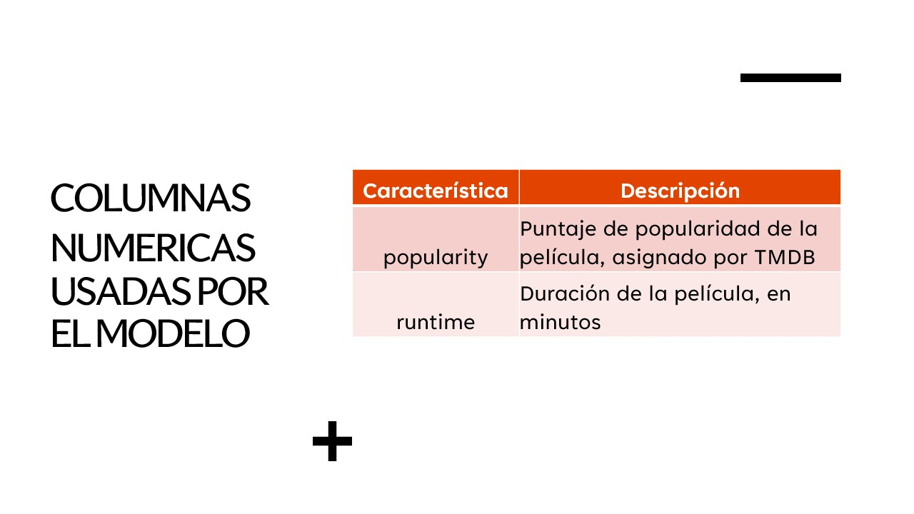

<h1 align=center> PROYECTO 01 HENRY ETAPA LABS </h1>

## INTRODUCCION
Este repositorio incluye el dataset, codigo, e implementacion de un sistema de recomendacion de
peliculas. 

Este proyecto es el primero de los dos que incluye la etapa "labs" del bootcamp SoyHenry.

El archivo main.py comprende la API desarrollada con el framework FASTAPI.

El archivo modelo.py comprende el sistema de recomendacion por contenido.

El archivo pipeline.ipynb es un notebook que resume todos los procesos que se realizaron al dataset original.

El archivo requirements.txt contiene las librerias minimas para hacer uso de la api con el modelo.

La carpeta data contiene: el dataset original (raw_data.csv), el final (latest.csv), y el vocabulario (latest_vocab.csv).

La carpeta code contiene los codigos que corresponden al ETL y EDA realizado.

## COMO HACER USO DEL SISTEMA DE RECOMENDACION
Para aquellos con muy poca paciencia, explico a continuacion como hacer uso del sistema de recomendacion.
### DESCRIPCION DE LA API

A traves del siguiente base url https://henry-labs-01.onrender.com/ pueden acceder a la API.

La API contiene 7 endpoints, los cuales retornan un diccionario.

Detallare cada uno brevemente:
<ul>
    <li>/peliculas_mes/{mes}: devuelve la cantidad de peliculas estrenadas en dicho mes.</li>
    <li>/peliculas_dia/{dia}: devuelve la cantidad de peliculas estrenadas en dicho dia.</li>
    <li>/franquicia/{franquicia}: devuelve la cantidad de peliculas, ganancia total y promedio por la franquicia dada.</li>
    <li>/peliculas_pais/{pais}: devuelve la cantidad de peliculas producidas por dicho pais.</li>
    <li>/productoras/{productora}: devuelve la cantidad de peliculas, y ganancias totales por la productora.</li>
    <li>/retorno/{pelicula}: devuelve la inversion, ganancia, retorno, y año de lanzamiento de la pelicula dada.</li>
    <li>/recomendacion/{pelicula}: devuelve 5 recomendaciones para la pelicula dada.</li>
</ul>

#### EJEMPLO DE USO:
Por ejemplo: si se quisiera saber las recomendaciones para la pelicula "toy story" se debera ingresar como url lo siguiente:
https://henry-labs-01.onrender.com/recomendacion/toy%20story (%20 es el caracter asociado al espacio).

Otro ejemplo: si quiero conocer cuantas peliculas fueron producidas por Argentina, debere ingresar:

https://henry-labs-01.onrender.com/peliculas_pais/argentina

#### RECOMENDACIONES:
A pesar de los ejemplos, recomiendo encarecidamente que hagan uso de la API a traves del siguiente URL:

https://henry-labs-01.onrender.com/docs

En ella, entraran a la documentacion interactiva de la API creada automaticamente, lo cual facilita enormemente su uso.

## DESCRIPCION DEL PROBLEMA
### CONTEXTO
El contexto que SoyHenry nos pasa es el siguiente:

Empezamos a trabajar como "Data Scientist" para una start-up que provee servicios de agregacion 
de plataformas de streaming. Nuestro rol es crear un sistema de recomendacion. 
Para ello, dentro de 1 semana deberemos proporcionar a un MVP (Minimum Value Product). El proyecto implica
un trabajo de MLOps, en el cual: debemos procesar los datos, crear un sistema de recomendacion, crear una API, 
deployarla y hacerla accesible a traves del internet junto con el modelo. Por ultimo, debemos mostrar 
a traves de un video que nuestro producto se realizo correctamente y es funcional

### MVP
El minimum value product debe cumplir ciertos requisitos, a saber:
#### MVP en Ingenieria de Datos
Nos piden: 
<ol>
    <li>Tener realizado el ETL.</li>
    <li>Tener la API deployada, listo para ser consumida con al menos 1 endpoint funcional.</li>
    <li>Tener el video que muestre que todo funciona correctamente.</li>
</ol>

#### MVP en Machine Learning
Nos piden:
<ol>
    <li>Tener realizado el EDA, analizando los datos.</li>
    <li>Tener un endpoint en la API deployada, listo para consumir el modelo.</li>
    <li>Tener el modelo funcionando, minimo, en el video.</li>
</ol>

#### PRODUCTO COMPLETO
El producto completo debe contener, lo anterior, mas:
<ol>
    <li>Readme completo y detallado.</li>
    <li>Los 6 endpoints basicos (sin contar el del modelo) funcionando.</li>
    <li>Una interfaz grafica.</li>
</ol>

## SOLUCION PLANTEADA

### DESCRIPCION GENERAL
La solucion planteada se puede resumir con la siguiente imagen:

Como se comento al inicio, la solucion completa esta incluida en 3 archivos, los cuales
cada uno corresponden con los pasos de la imagen. Cada uno de los archivos python estan debidamente documentados.

(1)

El archivo pipeline es el encargo de aplicar las transformaciones requeridas por el negocio, 
y otras necesarias para la integracion con el sistema de recomendacion. Ademas, el codigo mismo comprende
el caso en que se ingresen nuevos datos; esto es, se encarga la funcion pipeline de actualizar el dataset
"latest.csv" y "latest_vocab.csv".

(2)

El archivo model.py incluye la funcion recomendar() el cual es la encargada de retornar 
las 5 peliculas recomendadas para un "target_movie" dado. Este archivo es altamente 
customizable, y se pueden usar otros criterios/metricas para el calculo de la similitud.
El archivo model.py es importado luego por el main.py.

(3)

El main.py contiene el codigo relacionado con la API y los endpoints. Esta importa el dataset
previamente transformado usando pipeline.ipynb, y hace uso de la funcion recomendar() para devolver
las peliculas recomendadas segun la entrada del usuario.

### DATASET
El dataset original estaba formado por un archivo "csv" que contenia 24 columnas para 45573 filas.
Cada fila representaba una pelicula. Con pipeline.ipynb creamos dos archivos .csv mas: "latest.csv" y "latest_vocab.csv".
El primero contiene las columnas a utilizar por la API y el modelo junto con los datos originales ya transformados. El
segundo, es una csv que contiene por filas un "token", esto es, una o varias palabras pertenecientes a la columna "doc"
del dataset "latest.csv". Es decir, unamos todos los valores de la columna "doc" para cada fila en "latest.csv" y quedemos
con los "token" unicos, y eso lo almacenamos en el archivo "latest_vocab.csv". Otra forma de pensarlo es como si 
fuese un diccionario, donde las unicas palabras permitidas son aquellas que se encuentran en el diccionario.

### SISTEMA DE RECOMENDACION
Un sistema de recomendacion, como la palaba lo dice, es un modelo que recomienda servicios/contenidos en base
a un criterio dado. En general, se pueden clasificar tres tipos de sistemas de recomendacion:

#### Naive: 
El naive realiza una recomendacion por una metrica como la tendencia, 
los ultimos lanzamientos o por el genero. Su recomendacion no esta focalizada para un usuario,
sino que es basado en una metrica general, donde todos los usuarios reciben la misma recomendacion.

#### Recomendacion basadas en el usuario:

Estas recomendaciones ya se basan en la actividad del usuario explicita o implicita.
Por lo que suelen ser, si bien mas complejas, mas efectivas. Existen de dos tipos:

**Filtrado colaborativo**:
El filtrado colaborativo es una técnica que usan los sistemas de recomendación 
para ofrecer sugerencias personalizadas a los usuarios basándose en las 
preferencias o gustos de otros usuarios similares

**Filtro por contenido**:
El filtro por contenido es una técnica que usa las características del producto o 
del contenido para hacer recomendaciones. No depende de las valoraciones de otros usuarios,
sino que depende enteramente del contenido del producto. 

En el ejemplo de abajo, observamos como se recomiendan articulos similares a 
los leidos por un usuario.

Estes el tipo de sistema de recomendacion que creamos, 
debido a las restricciones del dataset.

Para llevar a cabo este sistema de recomendacion debemos determinar cuan similar es una pelicula
respecto a otras, y recomendar aquellas que son mas similares. Para ello, debimos transformar
los valores de tipo texto en vectores numericos, luego unirlos con los valores numericos (como el runtime),
para por ultimo calcular la similitud entre peliculas.

#### NOTAS EXTRAS:
Dentro del archivo pipeline.ipynb se encontraran el uso de Spacy.

Spacy es una libreria para el procesamiento de lenguaje natural. La utilizamos para extraer
palabras claves para cada pelicula de la columna "overview". La columna "overview" contiene
una breve descripcion del argumento de la pelicula.

Por otro lado, en el archivo model.py encontraran el uso de TfidfVectorizer y cosine_similarity:

TfidfVectorizer es una clase de scikit-learn que convierte una colección de documentos 
de texto en una matriz de características de TF-IDF. TF-IDF significa frecuencia 
de término-frecuencia inversa de documento, y es una medida que indica la 
importancia de una palabra en un documento dentro de un corpus. En resumen, utilizamos
la clase para convertir el texto en la columna "doc" en valores numericos.

Finalmente, usamos la funcion "cosine_similarity" para calcular la similitud entre peliculas.

### RESUMEN SOBRE EL TRATAMIENTO DE LAS COLUMNAS
Las siguientes imagenes resumen para aquel que le interese saber especificamente que columnas del dataset original eliminamos
por criterio del negocio eliminamos, o cuales usamos para crear la columna "doc" y el "vocab", y las columnas 
numericas con las que alimentamos el modelo en cojunto con "doc".

#### ELIMINADAS POR CRITERIO DE NEGOCIO

#### COLUMNAS DE TEXTO USADAS PARA CREAR LA COLUMNA DOC

#### COLUMNAS NUMERICAS USADAS EN EL MODELO

## FUENTES Y MATERIAL DE APOYO
Gran parte de este proyecto se baso en otros recursos que consumi, a continuacion listo algunos de
ellos que quizas les son utiles para otros queriendo hacer un proyecto similar:
<ul>
    <li>https://www.youtube.com/watch?v=9KWVIZJfm8Q&ab_channel=InstitutoHumai</li>
    <li>https://a-elkhattam.medium.com/imdb-movie-recommendation-chatbot-942f84dfa0dc</li>
    <li>https://course.spacy.io/en/</li>
    <li>https://fastapi.tiangolo.com/tutorial/</li>
</ul>

